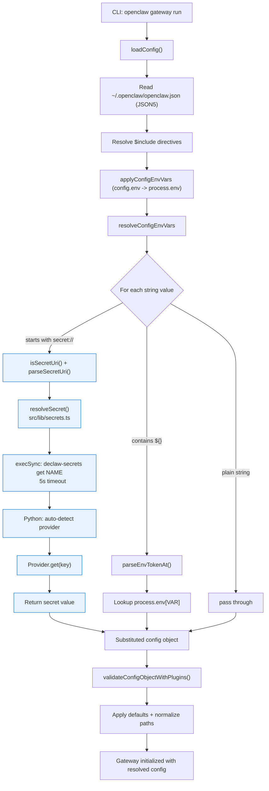
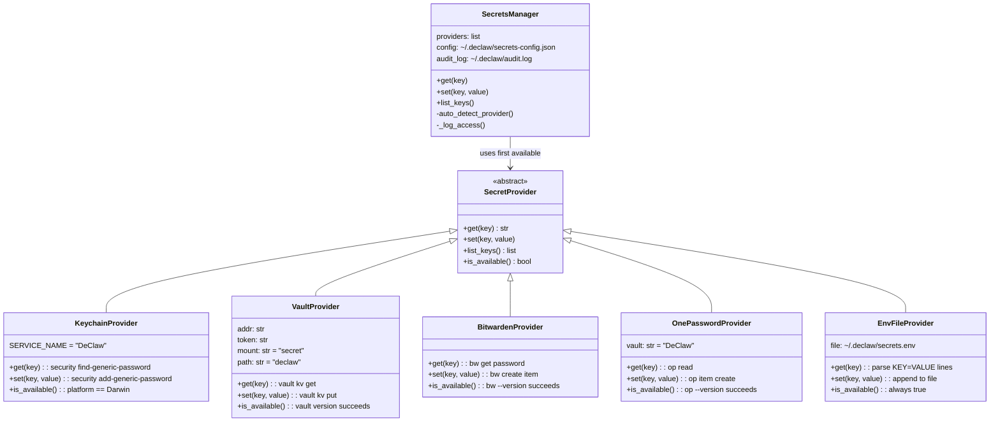
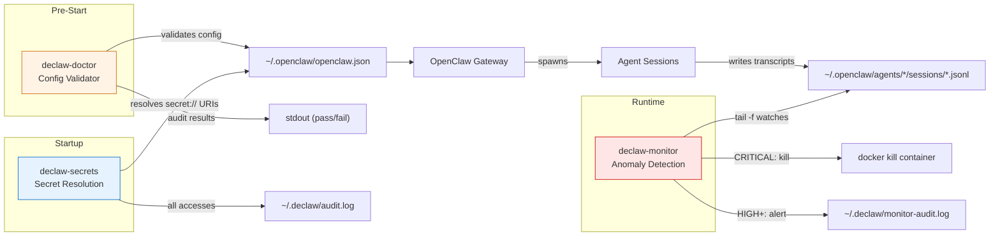
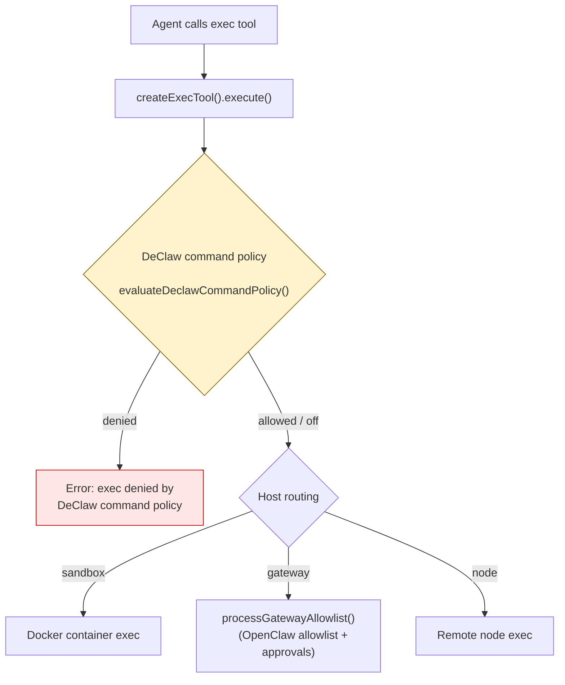
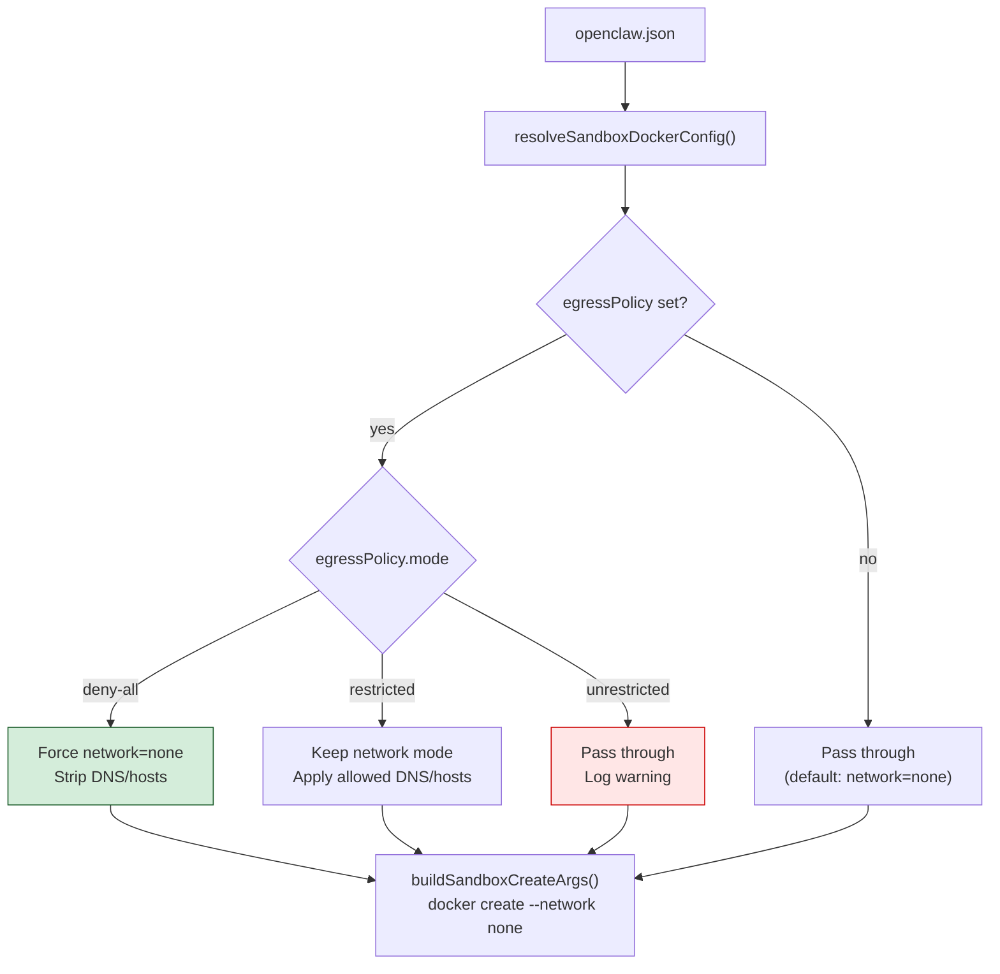
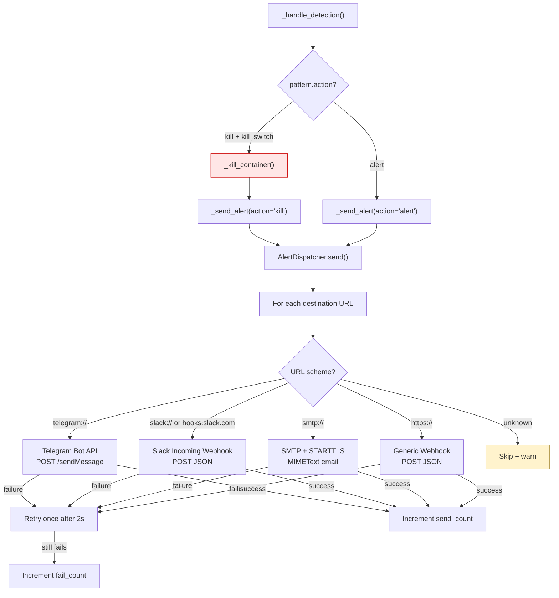
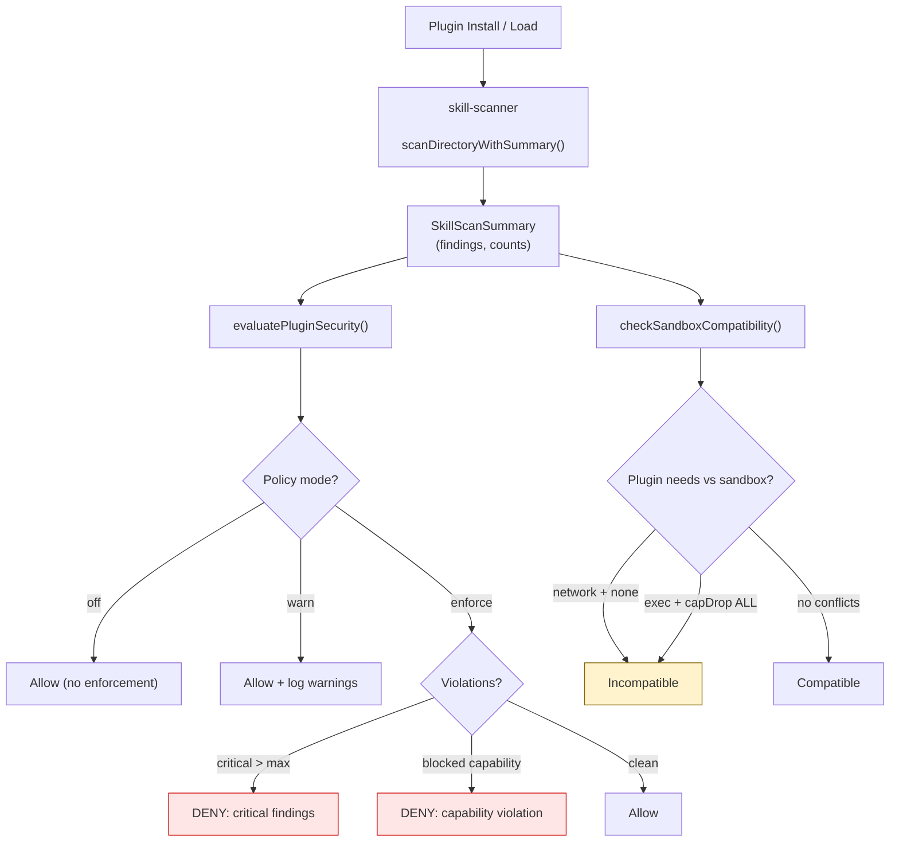
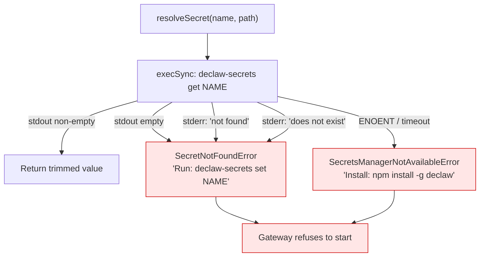

# DeClaw Architecture

DeClaw adds security layers to OpenClaw's config loading pipeline, startup
validation, and runtime monitoring. This document covers only the DeClaw-specific
architecture. For upstream OpenClaw internals, see the OpenClaw docs.

## Config Loading Pipeline

DeClaw hooks into OpenClaw's config loading at step 5 below. The `secret://`
check runs before `${}` env var substitution so vault-stored secrets take
priority over environment variables.



**Key files:**

- `src/config/io.ts` -- Config orchestrator (loadConfig, include resolution, validation)
- `src/config/env-substitution.ts` -- `substituteString()` with secret:// check (lines 91-99)
- `src/lib/secrets.ts` -- TypeScript bridge to Python via execSync
- `scripts/declaw-secrets/declaw-secrets` -- Multi-provider secrets manager

## Secrets Provider Architecture

The secrets manager uses an abstract provider pattern with auto-detection.
On first call, it checks providers in priority order and uses the first
available one.



**Auto-detection priority:** Keychain > Vault > Bitwarden > 1Password > EnvFile

## Security Tools Overview

Three standalone Python tools provide defense-in-depth at different stages:



## declaw-doctor Check Matrix

| ID  | Check                               | Severity | Auto-Fix                 |
| --- | ----------------------------------- | -------- | ------------------------ |
| C1  | Gateway auth token (32+ chars)      | CRITICAL | Generate random token    |
| C2  | API keys in env vars (no secret://) | CRITICAL | No (requires migration)  |
| C3  | Sandbox mode enabled                | CRITICAL | Set mode to "all"        |
| H1  | Dangerous tools in allow list       | HIGH     | Remove dangerous entries |
| H2  | Exec approvals enabled              | HIGH     | Enable with targets      |
| H3  | readOnlyRoot on containers          | HIGH     | Set to true              |
| M1  | Context pruning enabled             | MEDIUM   | Set mode to "cache-ttl"  |
| M2  | Gateway bind (loopback or TLS)      | MEDIUM   | No (requires TLS setup)  |
| M3  | Capability drop on containers       | MEDIUM   | Set capDrop to ["ALL"]   |
| L1  | Reload mode (hot + debounce)        | LOW      | Set mode to "hot"        |

## declaw-monitor Detection Patterns

| Pattern          | Severity | Action | What It Detects                                       |
| ---------------- | -------- | ------ | ----------------------------------------------------- |
| ENV_ACCESS       | CRITICAL | kill   | `printenv`, `env`, `os.environ`, `/proc/self/environ` |
| BASE64_ENCODE    | CRITICAL | kill   | `base64`, `xxd`, `openssl enc`, `btoa`                |
| REVERSE_SHELL    | CRITICAL | kill   | `bash -i`, `python pty.spawn`                         |
| DOCKER_ESCAPE    | CRITICAL | kill   | `docker.sock`, `runc`, `cgroups`                      |
| EXFIL_TOOLS      | HIGH     | alert  | `curl -d`, `wget --post`, `nc -e`, `socat`            |
| CRED_SCAN        | HIGH     | alert  | `grep password`, `find .ssh`, `cat /etc/shadow`       |
| SUSPICIOUS_FILES | MEDIUM   | alert  | `rm -rf`, `chmod 777`, `dd if=`                       |
| PORT_SCAN        | MEDIUM   | alert  | `nmap`, `masscan`, `zmap`                             |
| API_SPAM         | LOW      | alert  | Excessive `web_fetch`, `web_search` calls             |
| LARGE_WRITE      | LOW      | alert  | `dd bs=`, `fallocate`, `truncate`                     |

CRITICAL patterns trigger the kill switch (if enabled): container killed,
block file created at `~/.declaw/AGENT_ID.blocked`, restart prevented.

## File System Layout

```
~/.openclaw/                        # OpenClaw config + data
  openclaw.json                     # Config (read by doctor, secrets resolver)
  agents/
    AGENT_ID/
      sessions/*.jsonl              # Transcripts (watched by monitor)

~/.declaw/                          # DeClaw local state
  secrets-config.json               # Provider config (vault addr, 1password vault)
  secrets.env                       # Fallback plaintext secrets (chmod 600)
  audit.log                         # Secret access audit trail (JSONL)
  monitor-audit.log                 # Detection audit trail (JSONL)
  AGENT_ID.blocked                  # Kill switch block files

project/                            # DeClaw repo
  src/lib/secrets.ts                # TypeScript bridge (execSync to Python)
  src/config/env-substitution.ts    # secret:// integration point
  scripts/declaw-secrets/           # Python secrets manager
  scripts/declaw-doctor/            # Python config validator
  scripts/declaw-monitor/           # Python anomaly detector
```

## Command Policy Enforcement (Phase 2)

DeClaw's command policy runs at the top of the exec handler — before host
routing, before the existing allowlist evaluation, before approval registration.
A denied command cannot be bypassed by user approval.



Config: `tools.exec.commandPolicy` (global) or per-agent override.

## Egress Policy Enforcement (Phase 2)

Egress policy enforcement hooks into `resolveSandboxDockerConfig()`, modifying
the Docker config before the container is created. The `deny-all` mode forces
`network=none` regardless of other settings.



Config: `agents.defaults.sandbox.docker.egressPolicy` or per-agent override.

## Webhook Alert Dispatch (Phase 2)

When `declaw-monitor` detects an anomaly, `AlertDispatcher` routes alerts to
one or more destinations based on URL scheme:



Config: `declaw-monitor monitor --webhook "telegram://BOT@CHAT, https://hook.example.com"`

## Plugin Security Scanning (Phase 2)

DeClaw wraps OpenClaw's existing `skill-scanner` and adds policy enforcement,
capability restriction, integrity verification, and sandbox compatibility:



Capabilities are mapped from skill-scanner rule IDs: `dangerous-exec` → exec,
`suspicious-network`/`potential-exfiltration` → network, `env-harvesting` → env,
`dynamic-code-execution` → eval, `crypto-mining` → crypto-mining.

Config: `plugins.pluginSecurity` in `openclaw.json`.

## Error Handling

Secret resolution errors fail fast (no silent fallback):


